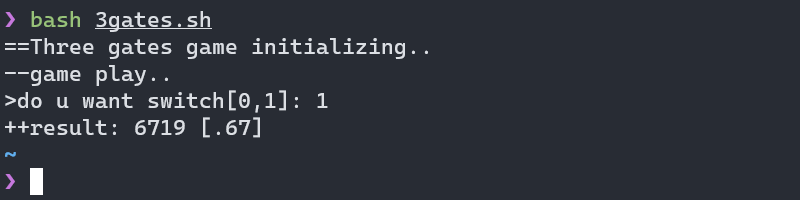

电影[**决胜21点**](https://baike.baidu.com/item/%E5%86%B3%E8%83%9C21%E7%82%B9/1052188?fr=aladdin "21-The Movie")里面提到了三门概率问题，改变选择是否确实提高了选到车的几率呢？

这里不详述理论方面，网上已经有非常好的解释了。此处用shell方式实验验证这个结论！

<!--more-->

## 问题预览

[**决胜21点**](https://baike.baidu.com/item/%E5%86%B3%E8%83%9C21%E7%82%B9/1052188?fr=aladdin "21-The Movie")课堂片段

## 问题描述

三门问题（Monty Hall problem）亦称为蒙提霍尔问题、蒙特霍问题或蒙提霍尔悖论，大致出自美国的电视游戏节目 Let's Make a Deal。

问题名字来自该节目的主持人蒙提・霍尔（Monty Hall）。

参赛者会看见三扇关闭了的门，其中一扇的后面有一辆汽车，另外两扇门后面则各藏有一只山羊。

当参赛者选定了一扇门，但未去开启它的时候，主持人会开启剩下两扇门中后面藏有羊的的其中一扇(*2门必定会有1门后面是羊*)。

主持人其后会问参赛者要不要更换选择(两门中另一个未开启的门)。

**问题**：换另一扇门是否会增加参赛者赢得汽车的机率?

**答案**: 会。

> 不换门的话，赢得汽车的几率是 `[1]/[3]`。换门的话，赢得汽车的几率是 `[2]/[3]`。

## 问题简单解析

> 主持人的选择，造成中间变成了条件选择概率<br/>
> 本来如果主持人未干预,更换选择在剩下的2个门中有车的概率仍然是`[1]/[3]`(剩下两个门有车的概率`[2]/[3]`，从2个门中选择一个的概率`1/2`，条件相乘: `[2]/[3] * [1]/[2] = [1]/[3]`)

* 1. 参赛者选择一扇门后面是车的概率是`[1]/[3]`
* 2. 反之如果此时参赛者同时选择另两扇门，则后面有车的概率是`[2]/[3]`
    > 加起来就是如果参赛者同时选择3个门，则必定后面有车
* 3.  现在主持人将2个门中必定不是车的打开，则`[2]/[3]`的概率就直接坍缩到剩下的门下
* 4. 所以更换选择，则能有[2]/[3]概率收获汽车

## shell实现思路

```sh
    define 数组[3]      #值1对应后面有车
    参赛者guest选择下标i #0<= i < 3
    主持人host选择下标j(从剩余两个中打开羊的那扇门,规则如下)
        0<= j < 3 同时 j != i
        if 数组[j] == 1， 重新选择
        返回j当数组[j] == 0
    参赛者更换选择
        除i，j剩下的索引，检查对应的值输出累计和
```

## shell代码

```sh
#!/usr/bin/env bash

echo "==Three gates game initializing.."
times=10000         # 总实验次数 1万

echo "--game play.."
read -p ">do u want switch[0,1]: " sw       # 是否更换选择

try=0
bingo=0
while :
do
    if [ $try -ge $times ];then
        break
    fi

    # 随机初始化门后车的位置
    case $((RANDOM%3)) in
        0)
            real=(0 0 1)
            ;;
        1)
            real=(0 1 0)
            ;;
        2)
            real=(1 0 0)
            ;;
    esac

    #echo "[[${real[@]}]]"

    # 参与者第一次选择
    choice=$((RANDOM%3))                    # 参与者选择
    case $choice in
        0)
            rest=(1 2)                      # rest是剩余可选下标
            ;;
        1)
            rest=(0 2)
            ;;
        2)
            rest=(0 1)
            ;;
    esac

    # 主持人从剩下的门中打开后面是羊的门
    while :
    do
        hsel=$((RANDOM%2))      # 只有两个门，存于rest
        host=${rest[$hsel]}
        if [ ${real[$host]} -eq 1 ];then        # 如果门后是车重新选择
            continue
        else
            break
        fi
    done

    #echo "u choose: $choice, host choose: $host"

    if [ $sw -eq 1 ];then
        # u choose switch every time
        final=$((3 - choice - host))
    else
        final=$choice
    fi

    hit=${real[$final]}
    #echo "final pick: $final, result: $hit"
    if [ $hit -eq 1 ];then
        let bingo++             # 统计选到车的次数
    fi
    let try++
done

rate=$(echo "scale=2;$bingo / $times"|bc)
echo "++result: $bingo [$rate]"
```

### 输出



## 后续

> 通过实验得到了一样的结果, 一开始违反直觉的逻辑其实还是思维的逻辑

> shell实现中可以看出，当剩下的两扇门后有车时主持人的选到车概率是从两扇门[1]/[2]的概率强制变为0

实际操作主持人知道哪扇门后有车, 直接避开了，这可能性就转移到了参与者身上

